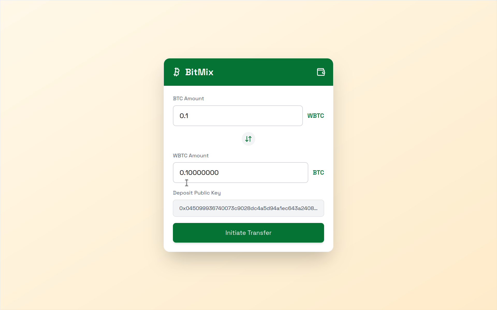
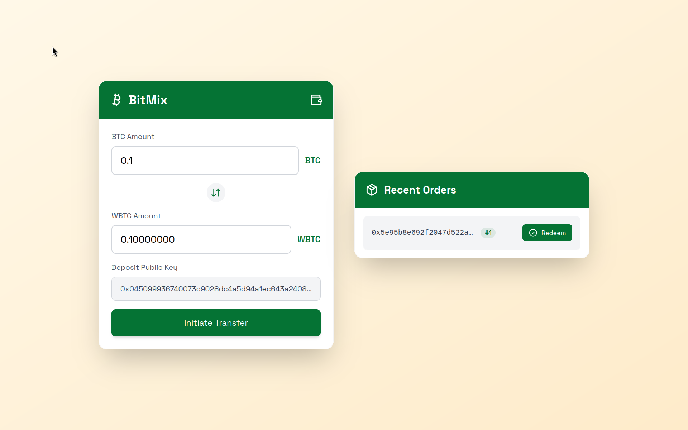

<a name="BitMix"></a>

<!-- PROJECT LOGO -->
<br />
<div align="center">
  <a href="#">
    
  </a>

  <p align="center">
    **BitMix - Seamless Cross-Chain Privacy**
    <br />
    <br />
    <a href="#">Live 🟢</a>
    |
    <a href="#">View Demo 🎬</a>
    |
    <a href="#screenshots">Screenshots 📸</a>
  </p>
</div>

---

## Table of Contents

1. [About The Project](#about-the-project)
2. [Problem Statement](#problem-statement)
3. [Solution](#solution)
4. [How It Works](#how-it-works)
5. [Use Cases](#use-cases)
6. [Built With](#built-with)
7. [Installation](#installation)
8. [Usage](#usage)
9. [Screenshots](#screenshots)

---

## About The Project

BitMix is a decentralized platform designed to enable secure and private cross-chain swaps between EVM and Non-EVM networks. Unlike traditional exchanges, BitMix prioritizes privacy using advanced zero-knowledge cryptographic mechanisms and ensures transaction security through locking mechanisms. With BitMix, users can experience reliable, private, and decentralized asset swaps.

---

## Screenshots

<p float="left">
  
   
</p>

---

## Problem Statement

Cross-chain swaps between EVM and Non-EVM ecosystems lack privacy, efficiency, and security. This exposes users to significant risks such as identity leaks and transaction failures. Existing solutions, such as THORSwap and RAILGUN, do not comprehensively address these challenges.

---

## Solution

BitMix provides a decentralized service enabling seamless and private swaps between EVM and Non-EVM chains. Key features include:

-   **Privacy**: Zero-knowledge cryptography ensures user anonymity.
-   **Security**: Advanced locking mechanisms protect funds.
-   **Decentralization**: Trustless architecture facilitates reliable swaps.

---

## How It Works

1. **Swap Initiation**

    - Alice requests a private swap using `Pub(A)`.
    - Locks 1 WBTC for 48 hours through a Signed SACP transaction.

2. **Monitor & Listen**

    - Bob creates a random `Priv(B)` and constructs a script address using `Pub(A)` and `Priv(B)`.
    - Submits a funding transaction to the script address.

3. **Citrea's Verification**

    - Verifies outputs match the expected `scriptPubKey`.
    - Confirms transaction inclusion in the Bitcoin block.
    - Checks encryption proof using ECIES.

4. **Completion**
    - BitMix decrypts Alice's message and constructs a script address using `Priv(A)` + `Pub(B)`.
    - Finalizes the BTC transaction and releases WBTC.

---

## Use Cases

-   **Private Cryptocurrency Swaps**: Ideal for traders seeking anonymity.
-   **Secure Wallet Transfers**: Enables safe transfers between custodial and non-custodial wallets.
-   **DeFi Integration**: Facilitates seamless interaction between DeFi protocols and Bitcoin.

---

## Built With

-   [![Rust][rust]][rust-url]
-   [![React][react.js]][react-url]
-   [![Covalent][covalent]][covalent-url]

---

## Installation

To set up the project, follow these steps:

1. Clone the repository:
    ```sh
    git clone https://github.com/your-repo/BitMix.git
    ```
2. Install dependencies:
    ```sh
    yarn
    ```

## Running the Project

There are four main ways to run this project: build a program, execute a program, generate a core proof, and
generate an EVM-compatible proof.

### Build the Program

To build the program, run the following command:

```sh
cd program
cargo prove build
```

### Execute the Program

To run the program without generating a proof:

```sh
cd script
cargo run --release -- --execute
```

This will execute the program and display the output.

### Generate a Core Proof

To generate a core proof for your program:

```sh
cd script
cargo run --release -- --prove
```

### Generate an EVM-Compatible Proof

> [!WARNING]
> You will need at least 128GB RAM to generate a Groth16 or PLONK proof.

To generate a proof that is small enough to be verified on-chain and verifiable by the EVM:

```sh
cd script
cargo run --release --bin evm -- --system groth16
```

this will generate a Groth16 proof. If you want to generate a PLONK proof, run the following command:

```sh
cargo run --release --bin evm -- --system plonk
```

These commands will also generate fixtures that can be used to test the verification of SP1 zkVM proofs
inside Solidity.

### Retrieve the Verification Key

To retrieve your `programVKey` for your on-chain contract, run the following command:

```sh
cargo prove vkey --program fibonacci-program
```

## Using the Prover Network

We highly recommend using the Succinct prover network for any non-trivial programs or benchmarking purposes. For more information, see the [setup guide](https://docs.succinct.xyz/generating-proofs/prover-network.html).

To get started, copy the example environment file:

```sh
cp .env.example .env
```

Then, set the `SP1_PROVER` environment variable to `network` and set the `SP1_PRIVATE_KEY`
environment variable to your whitelisted private key.

For example, to generate an EVM-compatible proof using the prover network, run the following
command:

```sh
SP1_PROVER=network SP1_PRIVATE_KEY=... cargo run --release --bin evm
```

---

## Usage

-   **Login**: Access the platform with your Ethereum wallet.
-   **Define Traits**: Customize your preferences and choose traits for ideal matches.
-   **Match & Swap**: Use the zero-knowledge-based algorithm for secure and private transactions.

---

<p align="center">
  Built with ❤️ by Team Crema | ETHIndia 2024
</p>

[rust]: https://img.shields.io/badge/Rust-orange?style=for-the-badge&logo=rust&logoColor=white
[rust-url]: https://www.rust-lang.org/
[react.js]: https://img.shields.io/badge/React-20232A?style=for-the-badge&logo=react&logoColor=61DAFB
[react-url]: https://reactjs.org/
[covalent]: https://img.shields.io/badge/-Covalent-blue
[covalent-url]: https://www.covalenthq.com/
